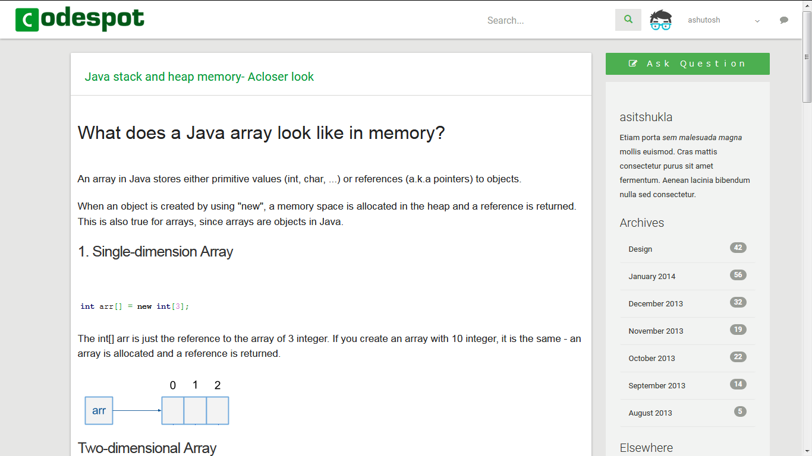

# Real-Time Private and feed Messaging Using STOMP Over WebSockets on Spring Security MVC

This project demonstrates the use of [STOMP](https://stomp.github.io/) over WebSockets on Spring MVC to send data to clients in real-time.
## Prerequisites

- [Maven](https://maven.apache.org/)
- [STOMP](http://stomp.github.io/)
- [Apache ActiveMQ](http://activemq.apache.org)
- [Spring Framework » 4.2.5.RELEASE](https://spring.io/blog/2016/02/25/spring-framework-4-2-5-available-now)
- [Spring Security » 4.0.4.RELEASE](https://docs.spring.io/spring-security/site/docs/current/reference/html/introduction.html#get-spring-security)
- [Spring WebSocket » 4.2.5.RELEASE](https://docs.spring.io/spring-security/site/docs/current/reference/html/websocket.html)
- [Spring Data JPA » 1.11.0.RELEASE](https://docs.spring.io/spring-data/jpa/docs/current/reference/html/)
- [Core Hibernate O/RM Functionality » 4.3.11.Final](http://hibernate.org/orm/releases/4.3/)
- [sockjs-0.3.4.min](http://sockjs.github.io/sockjs-client/)


##Download stomp.js JavaScript file
You can download [stomp.js](https://raw.githubusercontent.com/jmesnil/stomp-websocket/master/lib/stomp.js) to use it in your Web applications

A [minified version](https://raw.githubusercontent.com/jmesnil/stomp-websocket/master/lib/stomp.min.js) is also provided to be used in production.


#STOMP API
###STOMP Frame
STOMP Over WebSocket provides a straightforward mapping from a STOMP frame to a JavaScript object.


Frame Object

Property	|	Type	|	Notes
----------------------------------------------------
command	String	name of the frame ("CONNECT", "SEND", etc.)
headers	JavaScript object	
body	String	
The command and headers properties will always be defined but the headers can be empty if the frame has no headers. The body can be null if the frame does not have a body.

Create a STOMP client
In a Web browser with regular Web Socket
STOMP JavaScript clients will communicate to a STOMP server using a ws:// URL.

To create a STOMP client JavaScript object, you need to call Stomp.client(url) with the URL corresponding to the server's WebSocket endpoint:

```javascript
  var url = "ws://localhost:61614/stomp";
  var client = Stomp.client(url);
 ```
The Stomp.client(url, protocols) can also be used to override the default subprotocols provided by the library: ['v10.stomp', 'v11.stomp]' (for STOMP 1.0 & 1.1 specifications). This second argument can either be a single string or an array of strings to specify multiple subprotocols.

In the Web browser with a custom WebSocket
Web browsers supports different versions of the WebSocket protocol. Some older browsers does not provide the WebSocket JavaScript or expose it under another name. By default, stomp.js will use the Web browser native WebSocket class to create the WebSocket.

However it is possible to use other type of WebSockets by using the Stomp.over(ws) method. This method expects an object that conforms to the WebSocket definition.

For example, it is possible to use the implementation provided by the SockJS project which falls back to a variety of browser-specific transport protocols instead:


  <script src="http://cdn.sockjs.org/sockjs-0.3.min.js"></script>
  <script>
    // use SockJS implementation instead of the browser's native implementation
    var ws = new SockJS(url);
    var client = Stomp.over(ws);
    [...]
  </script>
Use Stomp.client(url) to use regular WebSockets or use Stomp.over(ws) if you required another type of WebSocket.

Apart from this initialization, the STOMP API remains the same in both cases.

## Screenshots


## License

[Public Domain](http://choosealicense.com/licenses/unlicense/), or in other words, do whatever you want with it, but I provide no warranties of any kind so I can't be held responsible for any damages it may cause.
